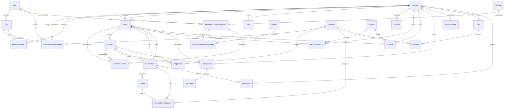

# 03 - Domain Model

Version: 1.0  
Status: Draft  
Owner: SCOT (Sports and Cultural Organizers of Topaz)  

---

## 1. Introduction
This document outlines the domain model for the SCOT Community Operations Platform. It describes the entities, attributes, relationships, and data types required to support the platform's features, with a focus on enforcing multi-season data isolation, wing-level boundaries, and loose coupling for the Finance module.

---

## 2. Entity-Relationship Diagram (ERD)

---

## 3. Data Dictionary

### 3.1 Core / Organization Models

#### `Season`
Represents the yearly operations cycle (June to May).
* **`id`** (UUID, PK): Unique identifier.
* **`name`** (String, Unique): E.g., "Season 2025-26".
* **`startDate`** (Date): Start date of the season.
* **`endDate`** (Date): End date of the season.
* **`status`** (Enum): `ACTIVE`, `ARCHIVED`. Only one season may be `ACTIVE` at any time.

#### `Wing`
Represents a physical building wing in the society.
* **`id`** (UUID, PK): Unique identifier.
* **`name`** (String, Unique): Wing letter starting from "N" through "W" (N, O, P, Q, R, S, T, U, V, W).

#### `Flat`
Represents a physical apartment unit in the society.
* **`id`** (UUID, PK): Unique identifier.
* **`number`** (String): Flat number in format `[Floor][FlatNumber]` (e.g., 101, 102, 103, 104 up to 704; 4 flats per floor, 7 floors).
* **`wingId`** (UUID, FK -> `Wing`): The wing this flat belongs to.
* *Constraints:* Unique pair of `(wingId, number)`.

#### `Member`
Represents a registered SCOT organizer profile.
* **`id`** (UUID, PK): Unique identifier.
* **`name`** (String): Full name.
* **`phone`** (String, Unique): Contact number (Primary identifier).
* **`status`** (Enum): `ACTIVE`, `INACTIVE`.

#### `MemberSeasonAssignment`
Maps a SCOT member to a specific role in a season.
* **`id`** (UUID, PK): Unique identifier.
* **`memberId`** (UUID, FK -> `Member`): Reference to the member.
* **`seasonId`** (UUID, FK -> `Season`): The active season.
* **`role`** (Enum): `SCOT_ADMIN`, `CORE_TEAM`, `EVENT_CHAMPION`, `WING_COMMANDER`, `WING_CAPTAIN`.
* **`wingId`** (UUID, FK -> `Wing`, Nullable): Assigned wing (required for Wing Commander/Captain).
* *Constraints:* Unique pair of `(memberId, seasonId)`.

#### `Portfolio`
Represents a functional area within SCOT.
* **`id`** (UUID, PK): Unique identifier.
* **`name`** (String, Unique): E.g., "Finance", "Sponsorship", "Logistics", "Sports", "Cultural".
* **`description`** (Text, Nullable): Description of portfolio duties.

#### `MemberPortfolioAssignment`
Maps a member's seasonal assignment to a specific functional portfolio.
* **`id`** (UUID, PK): Unique identifier.
* **`memberAssignmentId`** (UUID, FK -> `MemberSeasonAssignment`): The member's seasonal assignment.
* **`portfolioId`** (UUID, FK -> `Portfolio`): The portfolio.
* *Constraints:* Unique pair of `(memberAssignmentId, portfolioId)`.

---

### 3.2 Resident Models

#### `Resident`
Represents a resident of the society.
* **`id`** (UUID, PK): Unique identifier.
* **`name`** (String): Full name.
* **`phone`** (String, Unique): Contact number (Primary identifier).
* **`status`** (Enum): `ACTIVE`, `INACTIVE`.

#### `ResidentFlatAssignment`
Maps a resident to a physical flat for a specific season.
* **`id`** (UUID, PK): Unique identifier.
* **`residentId`** (UUID, FK -> `Resident`): Reference to the resident.
* **`flatId`** (UUID, FK -> `Flat`): Reference to the flat.
* **`seasonId`** (UUID, FK -> `Season`): The active season.
* **`role`** (Enum): `HOME_CHIEF`, `HOME_MEMBER`.
* **`occupancyType`** (Enum): `OWNER`, `TENANT`.
* *Constraints:* Unique pair of `(residentId, flatId, seasonId)`. Max one `HOME_CHIEF` per `(flatId, seasonId)`.

---

### 3.3 Event & Competition Models

#### `Event`
Represents an event or festival organized by SCOT.
* **`id`** (UUID, PK): Unique identifier.
* **`seasonId`** (UUID, FK -> `Season`): Reference to the season.
* **`name`** (String): Event name.
* **`description`** (Text, Nullable): Event summary.
* **`type`** (Enum): `STANDALONE`, `UMBRELLA`.
* **`startDate`** (DateTime): Event start date.
* **`endDate`** (DateTime): Event end date.
* **`venue`** (String): E.g., "Clubhouse", "Main Ground", "B Wing Parking".
* **`timeDetails`** (String, Nullable): Time schedule description, e.g. "6:00 PM onwards".
* **`status`** (Enum): `PLANNED`, `ACTIVE`, `COMPLETED`, `CANCELLED`.

#### `SubEvent`
Represents a sub-activity under an umbrella event.
* **`id`** (UUID, PK): Unique identifier.
* **`umbrellaEventId`** (UUID, FK -> `Event`): Reference to parent event.
* **`name`** (String): Sub-event name.
* **`description`** (Text, Nullable): Sub-event details.
* **`startDate`** (DateTime): Start date.
* **`endDate`** (DateTime): End date.
* **`venue`** (String): E.g., "Badminton Court 1", "T Wing Lobby".
* **`timeDetails`** (String, Nullable): Time schedule description, e.g. "4:00 PM - 8:00 PM".
* **`status`** (Enum): `PLANNED`, `ACTIVE`, `COMPLETED`, `CANCELLED`.

#### `EventAssignment`
Maps Event Champions to events or sub-events.
* **`id`** (UUID, PK): Unique identifier.
* **`memberAssignmentId`** (UUID, FK -> `MemberSeasonAssignment`): Reference to the member assignment.
* **`eventId`** (UUID, FK -> `Event`, Nullable): Assigned umbrella or standalone event.
* **`subEventId`** (UUID, FK -> `SubEvent`, Nullable): Assigned sub-event.
* *Constraints:* Either `eventId` or `subEventId` must be non-null.

#### `Registration`
Represents a resident's registration for an event or sub-event.
* **`id`** (UUID, PK): Unique identifier.
* **`eventId`** (UUID, FK -> `Event`, Nullable): Reference to umbrella/standalone event.
* **`subEventId`** (UUID, FK -> `SubEvent`, Nullable): Reference to sub-event.
* **`residentId`** (UUID, FK -> `Resident`): Registered resident.
* **`registrationMethod`** (Enum): `SELF`, `WING_CAPTAIN`, `ON_SPOT`.
* **`registeredById`** (UUID, Nullable): ID of member/resident who registered this person.
* **`registeredAt`** (DateTime): Registration timestamp.
* *Constraints:* Unique pair of `(eventId, residentId)` or `(subEventId, residentId)`. Either `eventId` or `subEventId` must be non-null.

#### `Competition`
Represents a competition associated with an event.
* **`id`** (UUID, PK): Unique identifier.
* **`eventId`** (UUID, FK -> `Event`, Nullable): Reference to standalone event.
* **`subEventId`** (UUID, FK -> `SubEvent`, Nullable): Reference to sub-event.
* **`name`** (String): E.g., "Men's Single Carrom", "Inter-wing Football".
* **`type`** (Enum): `INDIVIDUAL`, `WING_BASED`.
* **`scoringRuleJson`** (JSONB): Dynamic configuration defining points (placement, participation, round-robin), tie-breaker ordering, walkover rules, and co-winner tie resolutions.
* **`status`** (Enum): `DRAFT`, `SCHEDULED`, `IN_PROGRESS`, `COMPLETED`.

#### `Fixture`
Represents a specific matchup or scheduled round in a competition.
* **`id`** (UUID, PK): Unique identifier.
* **`competitionId`** (UUID, FK -> `Competition`): Parent competition.
* **`name`** (String): E.g., "Quarterfinal 1", "Wing A vs Wing C".
* **`scheduledAt`** (DateTime): Match schedule.
* **`status`** (Enum): `SCHEDULED`, `LIVE`, `COMPLETED`, `POSTPONED`.

#### `CompetitionParticipant`
Represents a participant (resident or wing team) in a competition or fixture.
* **`id`** (UUID, PK): Unique identifier.
* **`competitionId`** (UUID, FK -> `Competition`): Parent competition.
* **`residentId`** (UUID, FK -> `Resident`, Nullable): Required for individual competitions.
* **`wingId`** (UUID, FK -> `Wing`, Nullable): Required for wing-based competitions.
* **`fixtureId`** (UUID, FK -> `Fixture`, Nullable): Optional link to specific fixture.
* **`attendanceStatus`** (Enum): `PENDING`, `PRESENT`, `ABSENT`.
* **`score`** (Decimal, Nullable): Score achieved.
* **`placement`** (Integer, Nullable): Final rank (e.g. 1, 2, 3).
* *Constraints:* Either `residentId` or `wingId` must be non-null.

#### `WingScore`
Tracks points awarded to a wing at the seasonal level.
* **`id`** (UUID, PK): Unique identifier.
* **`wingId`** (UUID, FK -> `Wing`): The wing receiving points.
* **`seasonId`** (UUID, FK -> `Season`): Active season.
* **`competitionId`** (UUID, FK -> `Competition`, Nullable): The competition that awarded points.
* **`points`** (Decimal): Points awarded.
* **`reason`** (String): Context, e.g. "1st place in Inter-wing Football".

---

### 3.4 Finance Models

#### `FlatContribution`
Tracks seasonal contributions per flat.
* **`id`** (UUID, PK): Unique identifier.
* **`flatId`** (UUID, FK -> `Flat`): Physical flat.
* **`seasonId`** (UUID, FK -> `Season`): Reference to the season.
* **`amount`** (Decimal): Contribution amount (defaults to ₹3000).
* **`status`** (Enum): `PENDING`, `PAID`.
* **`paymentDate`** (DateTime, Nullable): Receipt timestamp.
* **`recordedById`** (UUID, FK -> `Member`, Nullable): Reference to SCOT member who recorded the payment.
* *Constraints:* Unique pair of `(flatId, seasonId)`.

#### `Sponsor`
Tracks commercial sponsors and collections.
* **`id`** (UUID, PK): Unique identifier.
* **`seasonId`** (UUID, FK -> `Season`): Reference to the season.
* **`companyName`** (String): Sponsor name.
* **`contactPerson`** (String): Sponsor contact name.
* **`phone`** (String): Contact phone.
* **`amountCommitted`** (Decimal): Committed sponsorship amount.
* **`amountCollected`** (Decimal): Amount received.
* **`status`** (Enum): `COMMITTED`, `PARTIALLY_PAID`, `FULLY_PAID`.

#### `Vendor`
Maintains a master repository of suppliers.
* **`id`** (UUID, PK): Unique identifier.
* **`name`** (String): Vendor name.
* **`contactPerson`** (String): Contact name.
* **`phone`** (String): Contact phone.
* **`serviceCategory`** (String): E.g., "Sound", "Catering", "Electricity", "Prizes".
* **`rating`** (Decimal, Nullable): Performance evaluation rating (1.0 to 5.0).

#### `VendorQuotation`
Tracks event quotations received from vendors.
* **`id`** (UUID, PK): Unique identifier.
* **`seasonId`** (UUID, FK -> `Season`): Reference to the season.
* **`vendorId`** (UUID, FK -> `Vendor`): Reference to the vendor.
* **`eventId`** (UUID, FK -> `Event`, Nullable): Reference to the event context.
* **`amount`** (Decimal): Quoted cost.
* **`quotationFileUrl`** (String): Link to quotation document.
* **`status`** (Enum): `SUBMITTED`, `APPROVED`, `REJECTED`.

#### `Expense`
Tracks expenditures against events, vendors, or miscellaneous items.
* **`id`** (UUID, PK): Unique identifier.
* **`seasonId`** (UUID, FK -> `Season`): Reference to the season.
* **`category`** (Enum): `VENDOR`, `LOGISTICS`, `PRIZES`, `MISCELLANEOUS`.
* **`vendorId`** (UUID, FK -> `Vendor`, Nullable): Reference to vendor.
* **`eventId`** (UUID, FK -> `Event`, Nullable): Reference to event.
* **`description`** (String): Expenditure details.
* **`amount`** (Decimal): Spent amount.
* **`receiptUrl`** (String, Nullable): Link to receipt/bill.
* **`status`** (Enum): `DRAFT`, `PENDING_APPROVAL`, `APPROVED`, `REJECTED`, `DISBURSED`.
* **`approvedById`** (UUID, FK -> `Member`, Nullable): Reference to approving Core Team member.

---

### 3.5 Tasks, Communication, & Gallery Models

#### `Task`
Tracks operations tasks.
* **`id`** (UUID, PK): Unique identifier.
* **`seasonId`** (UUID, FK -> `Season`): Reference to the season.
* **`title`** (String): Short title.
* **`description`** (Text, Nullable): Work description.
* **`status`** (Enum): `OPEN`, `IN_PROGRESS`, `DONE`.
* **`assignmentType`** (Enum): `MEMBER`, `PORTFOLIO`, `EVENT_TEAM`.
* **`assignedMemberId`** (UUID, FK -> `Member`, Nullable): Linked if assigned to member.
* **`assignedPortfolioId`** (UUID, FK -> `Portfolio`, Nullable): Linked if assigned to portfolio.
* **`assignedEventId`** (UUID, FK -> `Event`, Nullable): Linked if assigned to event team.
* **`dueDate`** (Date, Nullable): Target completion date.

#### `Announcement`
Tracks announcements made by organizers.
* **`id`** (UUID, PK): Unique identifier.
* **`seasonId`** (UUID, FK -> `Season`): Reference to the season.
* **`title`** (String): Title.
* **`content`** (Text): Message body.
* **`scope`** (Enum): `GLOBAL`, `WING`, `EVENT`.
* **`wingId`** (UUID, FK -> `Wing`, Nullable): Required for Wing announcements.
* **`eventId`** (UUID, FK -> `Event`, Nullable): Required for Event announcements.
* **`createdById`** (UUID, FK -> `Member`): Reference to author.
* **`createdAt`** (DateTime): Timestamp of creation.

#### `Poll`
Tracks opinions and survey questions.
* **`id`** (UUID, PK): Unique identifier.
* **`seasonId`** (UUID, FK -> `Season`): Reference to the season.
* **`question`** (String): Question text.
* **`optionsJson`** (JSONB): Dynamic array of strings representing options.
* **`resultsVisible`** (Enum): `ALWAYS`, `AFTER_CLOSE`, `ADMIN_ONLY`.
* **`status`** (Enum): `ACTIVE`, `CLOSED`.
* **`createdById`** (UUID, FK -> `Member`): Reference to author.
* **`createdAt`** (DateTime): Timestamp of creation.

#### `PollVote`
Tracks votes cast by residents.
* **`id`** (UUID, PK): Unique identifier.
* **`pollId`** (UUID, FK -> `Poll`): Reference to the poll.
* **`residentId`** (UUID, FK -> `Resident`): Reference to the voting resident.
* **`selectedOption`** (String): The chosen option value.
* **`votedAt`** (DateTime): Timestamp of vote.
* *Constraints:* Unique pair of `(pollId, residentId)`.

#### `GalleryAlbum`
Organizes media files into seasonal/event albums.
* **`id`** (UUID, PK): Unique identifier.
* **`seasonId`** (UUID, FK -> `Season`): Reference to the season.
* **`eventId`** (UUID, FK -> `Event`, Nullable): Associated event.
* **`subEventId`** (UUID, FK -> `SubEvent`, Nullable): Associated sub-event.
* **`title`** (String): Album name.
* **`description`** (Text, Nullable): Album summary.
* **`createdById`** (UUID, FK -> `Member`): Author.

#### `MediaItem`
Represents an individual photo or video within an album.
* **`id`** (UUID, PK): Unique identifier.
* **`albumId`** (UUID, FK -> `GalleryAlbum`): Parent album.
* **`type`** (Enum): `PHOTO`, `VIDEO`.
* **`url`** (String): File storage URL.
* **`uploadedById`** (UUID, FK -> `Member`): Uploader.
* **`uploadedAt`** (DateTime): Upload timestamp.

---

## 4. Multi-Season Lifecycle and Isolation Design

### 4.1 Data Isolation Policy
To guarantee historical data integrity, all entities representing operational activities (registrations, scores, contributions, expenses, sponsors, tasks, announcements, polls, gallery items) reference the active `Season` entity directly via a `seasonId` foreign key. 
* **Query Scoping:** Every business logic query retrieves records where `seasonId = active_season_id`.
* **Read-only Archive:** When a season's status changes from `ACTIVE` to `ARCHIVED`, all update operations on entities belonging to that season must be disabled by the authorization layer.

### 4.2 Season Transition Design
When a new season is initiated (e.g., transition from 2025-26 to 2026-27):
1. **Physical Entities Preservation:** `Wing` and `Flat` entities remain unchanged as they are permanent physical entities.
2. **Member/Resident Reference Partitioning:** `Member` and `Resident` master records remain in place, but their seasonal assignments (`MemberSeasonAssignment`, `ResidentFlatAssignment`) are clean slates. They must be newly created for the new season. This handles residents moving out/in, or organizers changing portfolios.
3. **Flat Contribution Reset:** A new set of `FlatContribution` records is initialized (all flats start as `PENDING` with ₹3000 dues for the new season).
4. **Events, Tasks, & Communications Slate:** No operational items (events, tasks, sponsors, gallery albums, polls) carry over automatically, ensuring a fresh operational scope while preserving archived data.
