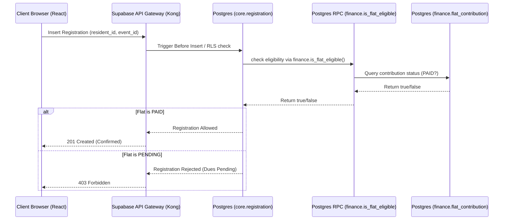

# 04 - Module Decomposition

Version: 1.0  
Status: Draft  
Owner: SCOT (Sports and Cultural Organizers of Topaz)  

---

## 1. Introduction
This document defines the modular architecture of the SCOT Community Operations Platform. To ensure clean separation of concerns and respect the project constitution under a serverless architecture, module boundaries are enforced logically:
1. **Database Schema Partitioning:** Distinct schemas (e.g., `core` vs. `finance`) partition tables in the PostgreSQL database.
2. **Frontend Feature Isolation:** Frontend code is structured by feature directories (e.g., `src/features/organization`, `src/features/finance`).
3. **Decoupled API Actions:** Modules communicate via database functions (RPCs) and client SDK queries.

A key architectural constraint is that the **Finance module must remain plug-and-play** so it can be modified, replaced (e.g., with external accounting software or payment gateways), or extended without modifying the core system.

---

## 2. Module Dependency Graph

The diagram below shows the high-level boundaries and allowed dependency flows between modules. Dependencies flow strictly downwards and outwards; circular dependencies are forbidden.

```mermaid
graph TD
    %% Core Modules
    subgraph Core System (core schema)
        OrgMod[Organization Module]
        ResMod[Resident Module]
        CommMod[Communication Module]
        EventMod[Events & Competitions Module]
        TaskMod[Tasks Module]
        GalMod[Media Gallery Module]
    end

    %% Decoupled Finance
    subgraph Plug-and-Play Finance (finance schema)
        FinMod[Finance Module]
    end

    %% Reporting Cross-Cutter
    subgraph Reporting
        RepMod[Reporting Module]
    end

    %% Dependencies
    ResMod --> OrgMod
    CommMod --> OrgMod
    CommMod --> ResMod
    
    EventMod --> OrgMod
    EventMod --> ResMod
    
    TaskMod --> OrgMod
    TaskMod --> EventMod
    
    GalMod --> OrgMod
    GalMod --> EventMod
    
    %% Communication with Finance is decoupled via Interfaces
    EventMod -.-> |Eligibility Check RPC| FinMod
    FinMod --> |Read Core IDs| OrgMod
    
    %% Reporting reads from modules via read-only queries
    RepMod --> OrgMod
    RepMod --> EventMod
    RepMod --> FinMod
    RepMod --> TaskMod

    style FinMod fill:#f9f,stroke:#333,stroke-width:2px
    style OrgMod fill:#bbf,stroke:#333,stroke-width:1px
```

---

## 3. Module Specifications

### 3.1 Organization Module (`core` schema)
* **Responsibilities:**
  - Manages seasonal transition lifecycle.
  - Controls permanent physical layout (Wings, Flats).
  - Manages SCOT organizational structure, roles, and portfolio assignments.
* **Entities Owned:** `Season`, `Wing`, `Flat`, `Member`, `MemberSeasonAssignment`, `Portfolio`, `MemberPortfolioAssignment`.
* **Logical Database APIs (SQL Views / RPCs):**
  - `core.get_active_season() -> core.Season`
  - `core.is_flat_valid(wing_name VARCHAR, flat_number VARCHAR) -> BOOLEAN`
* **Dependencies:** None.

### 3.2 Resident Module (`core` schema)
* **Responsibilities:**
  - Manages resident user onboarding and logins.
  - Links physical flats to occupants (Home Chiefs and Home Members) on a seasonal basis.
* **Entities Owned:** `Resident`, `ResidentFlatAssignment`.
* **Logical Database APIs (SQL Views / RPCs):**
  - `core.get_resident_flat(resident_id UUID, season_id UUID) -> core.Flat`
  - `core.get_flat_occupants(flat_id UUID, season_id UUID) -> List<core.Resident>`
* **Dependencies:** Organization Module.

### 3.3 Communication Module (`core` schema)
* **Responsibilities:**
  - Facilitates global, wing-level, and event-level announcements.
  - Manages polls, options, and anonymous voting for residents.
* **Entities Owned:** `Announcement`, `Poll`, `PollVote`.
* **Dependencies:** Organization Module, Resident Module.

### 3.4 Events & Competitions Module (`core` schema)
* **Responsibilities:**
  - Manages event lifecycle (Umbrella and Standalone events).
  - Assigns Event Champions to events/sub-events.
  - Handles resident self-registrations, team registrations, and on-spot registrations.
  - Organizes competitions, fixture schedules, attendance, and placement scoring.
* **Entities Owned:** `Event`, `SubEvent`, `EventAssignment`, `Registration`, `Competition`, `Fixture`, `CompetitionParticipant`.
* **Dependencies:** Organization Module, Resident Module, Finance Module (only via decoupled RPC functions).

### 3.5 Tasks Module (`core` schema)
* **Responsibilities:**
  - Handles task generation, portfolios assignments, and due-date tracking.
* **Entities Owned:** `Task`.
* **Dependencies:** Organization Module, Events & Competitions Module.

### 3.6 Media Gallery Module (`core` schema)
* **Responsibilities:**
  - Creates albums corresponding to events or seasons.
  - Handles uploading, streaming, and removing photos and videos.
* **Entities Owned:** `GalleryAlbum`, `MediaItem`.
* **Dependencies:** Organization Module, Events & Competitions Module.

### 3.7 Finance Module (Plug-and-Play Boundary / `finance` schema)
* **Responsibilities:**
  - Tracks annual flat-level contribution dues.
  - Records sponsor commitments and collections.
  - Stores vendor details and quotations.
  - Manages expense recording and Core Team approval workflows.
* **Entities Owned:** `FlatContribution`, `Sponsor`, `Vendor`, `VendorQuotation`, `Expense`.
* **Exported Decoupled RPCs:**
  - `finance.is_flat_eligible(flat_id UUID, season_id UUID) -> BOOLEAN` (Returns true if FlatContribution status is `PAID` for the season)
  - `finance.record_payment(flat_id UUID, season_id UUID, amount DECIMAL, recorder_id UUID) -> finance.FlatContribution`
* **Dependencies:** Organization Module (reads `core.Flat` and `core.Season` metadata). Does NOT depend on Events, Communications, Tasks, or Gallery.

### 3.8 Reporting Module
* **Responsibilities:**
  - Compiles multi-module reports (Participation statistics, Financial statements, Wing championship standings, Vendor and expense analyses).
* **Entities Owned:** `core.WingScore` (for tracking the Wing Championship scores).
* **Dependencies:** Depends on all module schemas (reads data to compile statistics) but no modules depend on Reporting.

---

## 4. Plug-and-Play Finance Architecture

To keep the Finance module decoupled and plug-and-play, the system enforces the following design rules:

### 4.1 Schema Isolation
* **No Direct Foreign Keys:** Core tables (like `core.event` or `core.member`) do not contain foreign keys referencing tables in the Finance schema (like `finance.expense` or `finance.vendor_quotation`).
* **Logical Relationships:** Where a relationship is required (e.g., an `Expense` is incurred for an `Event`), the Finance database table stores `eventId` as a plain UUID field. It does not enforce a database-level `FOREIGN KEY` constraint. If the Events module database is restructured, the Finance database schema remains unaffected.

### 4.2 Decoupled Interface Contract (The eligibility gate)
The Events module needs to block residents from registering for paid-participating events if their flat's seasonal contribution is unpaid. Rather than joining core tables with finance tables, this boundary is managed via a schema-level trigger or RLS check calling the database RPC:



By defining the RPC function `finance.is_flat_eligible`, we can swap the internal implementation to query a third-party accounting API (e.g., Stripe, QuickBooks, or Tally) in the future, without modifying a single line of registration code in the `core` schema.
