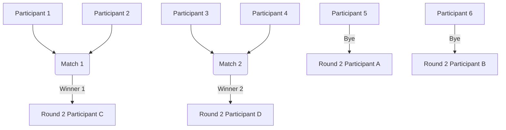

# 05 - Competition & Scoring Engine Specification

Version: 1.0  
Status: Draft  
Owner: SCOT (Sports and Cultural Organizers of Topaz)  

---

## 1. Introduction
This document defines the technical specifications, algorithms, mathematical models, and operational workflows for the Competition and Scoring Engine of the SCOT Community Operations Platform. This engine controls event configurations, automated fixture generation, score recording, and the aggregation of points into the seasonal Wing Championship leaderboard.

---

## 2. Competition Classifications

Competitions are configured per event (standalone or sub-event) and fall under two primary categories:

### 2.1 Individual Competitions
* **Description:** Residents register and compete as individuals (e.g., Chess, Drawing, Singing, Rangoli).
* **Participant Entity:** Linked to `Resident`.
* **Wing Score Impact:** Points won by an individual resident (placement or participation points) are credited to their flat's assigned `Wing`.
* **Multiple Entries per Wing:** Multiple residents from the same wing can register, participate, and win placements, with all points cumulatively adding to the wing's standing.

### 2.2 Wing-Based Competitions
* **Description:** Wings form composite teams to compete against other wings (e.g., Cricket, Football, Tug of War).
* **Participant Entity:** Linked to `Wing` (representing the wing's team).
* **Registration:** Wing Captains compile the wing team roster. Only one team per Wing is allowed per competition.
* **Wing Score Impact:** Points (1st, 2nd, 3rd, or participation) are awarded directly to the `Wing` entity.

---

## 3. Tournament Formats & Bracket Algorithms

The engine supports three tournament structures, configurable in the `Competition` model:

### 3.1 Knockout (Single Elimination)
Standard tournament bracket where the loser of each match is immediately eliminated.

#### 3.1.1 Power-of-Two Bracket Initialization
A perfect single-elimination bracket requires the number of participants $N$ to be a power of two ($2^k$). When $N$ is not a power of two, the engine must inject **Byes** in the first round.
* The size of the next power-of-two bracket is $2^k$, where $2^{k-1} < N \le 2^k$.
* Number of Byes to generate in Round 1: 
  $$B = 2^k - N$$
* Number of matches to play in Round 1: 
  $$M_1 = \frac{N - B}{2}$$
* Participants receiving a bye skip Round 1 and advance automatically to Round 2.

#### 3.1.2 Bye Allocation Rules
1. **Random Allocation:** In recreational/cultural competitions, byes are distributed randomly among participants.
2. **Wing-Isolation Seedings (For Sports):** To maximize early-round variety, byes are distributed such that no wing receives multiple byes unless all active wings have received at least one.



---

### 3.2 Round Robin
Every participant plays against every other participant once.

#### 3.2.1 Circle Method Scheduling Algorithm
For a list of $P$ participants:
1. If $P$ is odd, add a dummy participant "BYE". The actual size becomes $P' = P + 1$.
2. Number of rounds required: $R = P' - 1$.
3. Number of matches per round: $M = P'/2$.
4. **Algorithm Execution:**
   - Fix one participant in position 0 of an array.
   - Arrange the remaining $P'-1$ participants in a circle.
   - For each round, match the first half of the array with the second half (in reverse order). E.g., for 6 teams: `(0 vs 5, 1 vs 4, 2 vs 3)`.
   - Rotate all participants except position 0 clockwise by one position for the next round.

#### 3.2.2 Round Robin Table Scoring
The scoring system and tie-breaker sequence are configured per competition via `scoringRuleJson` (falling back to system-wide defaults if not specified).
* **Win Points:** Configurable value (default: 3 points).
* **Tie/Draw Points:** Configurable value (default: 1 point).
* **Loss Points:** Configurable value (default: 0 points).
* **Tie-Breaker Hierarchy:** Dynamically ordered sequence (default sequence below):
  1. Head-to-head match result.
  2. Net score difference (points scored minus points conceded in games).
  3. Total points scored.
  4. Random coin toss/draw.

---

### 3.3 Direct Performance Ranking (Judged Events)
For events without match-ups (e.g. Rangoli, Drawing, Singing).
* **Execution:** Participants perform once. Judges submit numerical scores (e.g., 1–100) or directly assign ranks (1st, 2nd, 3rd).
* **Resolution:** The engine sorts participants in descending order of judge scores to resolve placements.

---

## 4. Points Accumulation & Wing Standings

The Wing Championship leaderboard aggregates points across all competitions in a season. 

### 4.1 Scoring Configuration Schema
Each competition defines its points structure, scoring parameters, tie-breakers, and walkover policies in `scoringRuleJson`:

```json
{
  "placementPoints": {
    "firstPlace": 10,
    "secondPlace": 7,
    "thirdPlace": 5
  },
  "participationPoints": 2,
  "allowMultiplePlacementsPerWing": true,
  "participationPointsCap": null,
  "roundRobinPoints": {
    "win": 3,
    "draw": 1,
    "loss": 0
  },
  "roundRobinTieBreakers": [
    "HEAD_TO_HEAD",
    "NET_SCORE_DIFFERENCE",
    "TOTAL_POINTS",
    "COIN_TOSS"
  ],
  "walkoverRules": {
    "pointsAwardedToPresent": 2,
    "defaultScore": {
      "present": 2,
      "absent": 0
    },
    "forfeitParticipationPointsOnWalkover": true
  },
  "tiedPlacementResolution": "SPLIT"
}
```

#### Fields Description:
* **`placementPoints`**: Points awarded for 1st, 2nd, and 3rd place finishes.
* **`participationPoints`**: Points awarded to a participant or resident for entering the competition.
* **`allowMultiplePlacementsPerWing`**: Boolean. If true, all resident placements contribute points to their wing. If false, only the highest placement is counted.
* **`participationPointsCap`**: Optional integer/null. If set, limits the maximum participation points a wing can earn from its residents in a single individual competition.
* **`roundRobinPoints`**: Points assigned for fixtures in a Round Robin stage (`win`, `draw`, `loss`).
* **`roundRobinTieBreakers`**: Ordered array of criteria strings to resolve ties in Round Robin standings (e.g. `["HEAD_TO_HEAD", "NET_SCORE_DIFFERENCE", "TOTAL_POINTS", "COIN_TOSS"]`).
* **`walkoverRules`**: Defines the score and participation points behavior when an opponent is absent.
  - `pointsAwardedToPresent`: Points credited to the present participant.
  - `defaultScore`: The simulated score (e.g. 2-0) entered for the fixture.
  - `forfeitParticipationPointsOnWalkover`: Boolean. If true, the absent participant receives 0 points and no participation credit.
* **`tiedPlacementResolution`**: Method for resolving points when scores are tied. Supported values:
  - `"SPLIT"`: Sum the points for the tied placement and the subsequent placement, then divide equally among tied participants.
  - `"FULL"`: Award the full placement points to all tied participants.

### 4.2 Scoring Aggregation Logic
At the completion of a competition, points are added to `WingScore` based on the following mathematical logic:

Let:
* $P_{first}, P_{second}, P_{third}$ be the placement points configured.
* $P_{part}$ be the participation points configured.
* $W$ be the wing identifier.

#### For Wing-Based Competitions
A wing receives exactly one points allocation:
$$\text{Score}(W) = 
\begin{cases} 
P_{first} & \text{if Wing } W \text{ finishes 1st} \\
P_{second} & \text{if Wing } W \text{ finishes 2nd} \\
P_{third} & \text{if Wing } W \text{ finishes 3rd} \\
P_{part} & \text{if Wing } W \text{ participates but does not place} 
\end{cases}$$

#### For Individual Competitions
* **Scenario A: `allowMultiplePlacementsPerWing = true`**  
  Every resident's points contribute to their Wing:
  $$\text{Score}(W) = \sum_{r \in \text{Residents}(W)} \text{ResidentPoints}(r)$$
  *Example:* If Wing N has residents finishing 1st (10pts) and 3rd (5pts), plus 3 other participants (3 x 2pts = 6pts), Wing N receives: $10 + 5 + 6 = 21$ points.

* **Scenario B: `allowMultiplePlacementsPerWing = false`**  
  Only the highest placement scored by a resident from a wing is counted, plus participation points for other residents, subject to an optional cap $C_{part}$ (defined in `participationPointsCap`):
  $$\text{Score}(W) = \max_{r \in \text{Residents}(W)} (\text{PlacementPoints}(r)) + \min\left( \sum_{j \in \text{OtherResidents}(W)} P_{part}, C_{part} \right)$$
  *(If $C_{part}$ is null, the cap is ignored and participation points are uncapped.)*

---

## 5. Walkovers, Ties, and Edge Cases

### 5.1 Attendance & Walkover Rules
* **Rule:** If a participant (individual or wing team) is marked as `ABSENT` in a scheduled fixture, a **Walkover** is declared.
* **Resolution:**
  - The present opponent is marked as `COMPLETED_WALKOVER` and advances.
  - The present opponent is awarded the default score (defined in `walkoverRules.defaultScore`, e.g. 2-0, or custom per sport) and the configured points (`walkoverRules.pointsAwardedToPresent`).
  - The absent participant receives 0 score, is marked as a Loss, and status is resolved based on `walkoverRules.forfeitParticipationPointsOnWalkover`. If true, they forfeit participation points for that competition.

### 5.2 Knockout Tie-Breaker Rules
Knockout fixtures cannot end in a draw. The engine requires a binary winner:
1. **Sports:** Standard sport-specific resolution (e.g., penalty shoot-out for Football, super-over for Cricket, tie-breaker set for Badminton). The coordinator inputs the final tie-breaker winner.
2. **Cultural/Judged:** If two participants score equal points from judges, placement is resolved using the policy configured in `tiedPlacementResolution`:
   - **Scenario SPLIT:** The points for the tied placement and the subsequent placement are merged and split equally.
     *Example:* If two players tie for 1st place in Chess, they split the points for 1st and 2nd place:
     $$\text{Tied Points} = \frac{P_{first} + P_{second}}{2} = \frac{10 + 7}{2} = 8.5\text{ points each}$$
     No 2nd place is awarded; the next highest participant gets 3rd place.
   - **Scenario FULL:** Both participants receive the full points for the tied placement.
     *Example:* Both players receive $P_{first}$ (10 points each).

### 5.3 Seasonal Wing Standings Tie-Breaker
If two wings are tied on points at the end of a season, the winner is resolved based on the seasonal tie-breaker hierarchy configured in the system (default sequence below):
1. Wing with the highest number of 1st Place finishes wins the Championship.
2. If still tied, wing with the highest number of 2nd Place finishes wins.
3. If still tied, the wings share the Championship.
