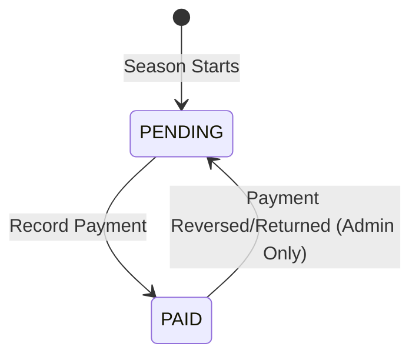
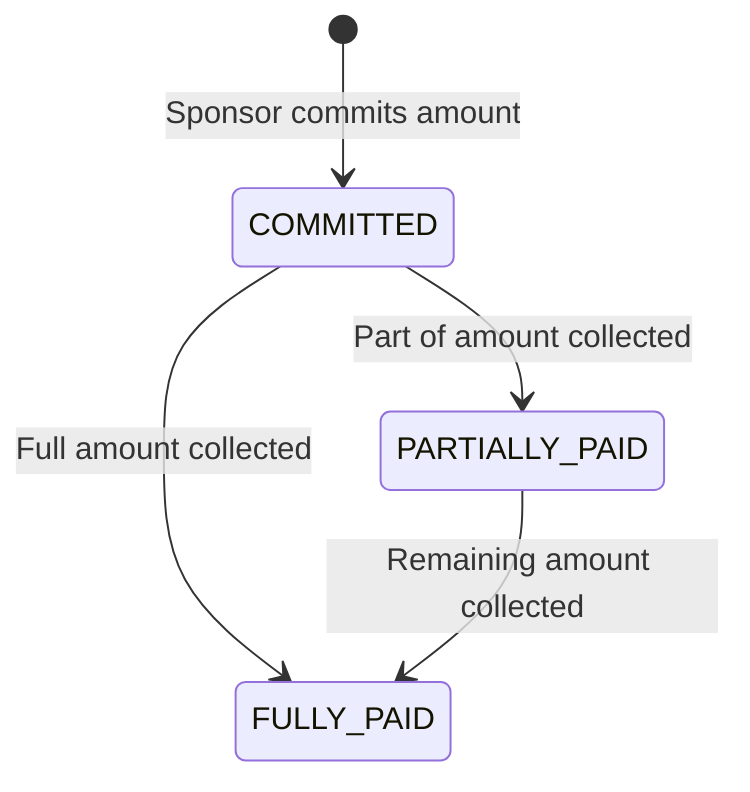
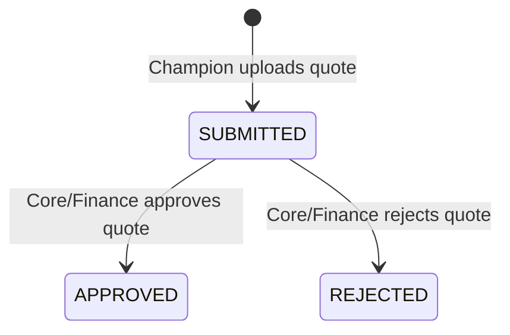
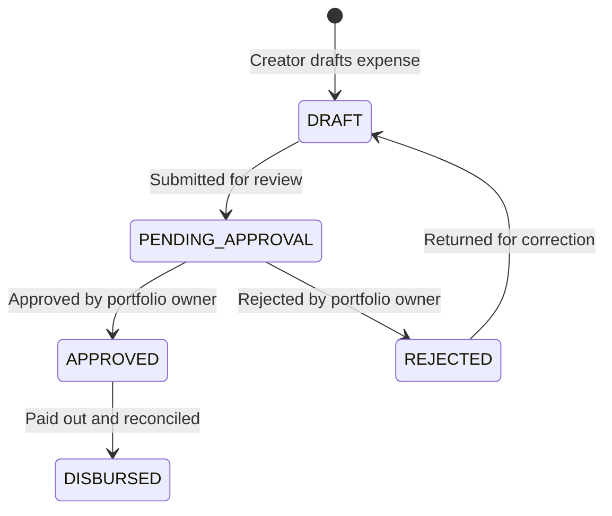

# 06 - Finance Operations Specification

Version: 1.0  
Status: Draft  
Owner: SCOT (Sports and Cultural Organizers of Topaz)  

---

## 1. Introduction & Architectural Boundary

The Finance Module handles all monetary aspects of the SCOT Community Operations Platform, including annual contributions, sponsorships, vendor relations, and expense management. 

To maintain the **plug-and-play** architecture mandated by the Project Constitution, the Finance Module must remain strictly decoupled from the core system. This ensures it can be modified, replaced, or integrated with third-party accounting systems (e.g., QuickBooks, Tally, or online payment gateways) in the future without impacting the core codebase.

### 1.1 Architectural Separation Rules
1. **Schema Isolation:** No database-level foreign keys exist between Core tables (`Event`, `Member`, `Resident`, etc.) and Finance tables (`Expense`, `VendorQuotation`, etc.). Relationships are maintained logically using UUID fields (e.g., storing `eventId` as a plain UUID in `Expense`).
2. **Eligibility Verification Gate:** The Events module queries the Finance module solely through the `FinanceGatekeeperInterface` to check whether a flat has paid its seasonal dues before permitting event registration.
3. **Uni-directional Dependencies:** Finance reads core season and organizational structure IDs, but the Core modules never import or directly depend on internal Finance data models.

---

## 2. Flat Contribution Tracking

Residents of Topaz contribute annually to fund seasonal events. 

### 2.1 Basic Contribution Rules
* **Default Amount:** ₹3000 per flat per season (configurable in season settings).
* **Target Audience:** All 280 flats across the 10 wings.
* **Payment Status:** Every flat begins the season with a status of `PENDING`.



### 2.2 Payment Recording Workflow
1. **Local Collection:** Wing Commanders or Core Team members collect cash or verify bank transfers from a resident.
2. **System Log:** The collector logs the payment in the system by calling `recordPayment()`. The system captures:
   * Flat ID and Season ID
   * Amount paid
   * Date and time of payment
   * ID of the member who recorded it (audit trail)
3. **State Transition:** The status of the flat's contribution transitions to `PAID`.
4. **Receipt Generation:** A PDF receipt is automatically generated and linked to the `FlatContribution` record, which becomes accessible to the flat's residents.

### 2.3 Eligibility Check (The Gatekeeper)
To register for any paid or participation-restricted event, a resident's flat must have a contribution status of `PAID` for the active season. The registration flow calls the following decoupled check:

```java
public interface FinanceGatekeeperInterface {
    /**
     * Verifies if a flat has completed its seasonal contribution.
     * 
     * @param flatId   the UUID of the flat
     * @param seasonId the UUID of the active season
     * @return true if the status is PAID, false otherwise
     */
    boolean isFlatEligible(UUID flatId, UUID seasonId);
}
```

---

## 3. Sponsorship Management

Sponsorships from local businesses and commercial entities represent a vital source of revenue for SCOT events.

### 3.1 Sponsor State Machine
The system tracks the lifecycle of sponsor commitments to ensure all pledged funds are fully collected.



### 3.2 Attributes and Metrics
* **`amountCommitted`**: The total sponsorship amount pledged.
* **`amountCollected`**: The cumulative amount received so far.
* **Operational Reporting:** The Sponsorship Portfolio owner can generate reports comparing committed vs. collected amounts to flag outstanding collection tasks.

---

## 4. Vendor Repository & Quotation Management

SCOT maintains a reusable directory of vendors to streamline negotiations and build history across seasons.

### 4.1 Vendor Repository
* **Master Records:** Unlike seasonal assignments, `Vendor` records persist across seasons.
* **Performance Rating:** After event completion, Event Champions can rate vendors (1.0 to 5.0 stars) to preserve organizational knowledge.

### 4.2 Quotation Management
For large events, Event Champions seek multiple bids from vendors. 



* **Attributes:** Records the logical `eventId` or `subEventId`, the associated `vendorId`, the quotation `amount`, and a link to the quote document.
* **Approval Rule:** Approving a quotation automatically moves all other quotations for the same event and service category to the `REJECTED` status.

---

## 5. Expense Lifecycle & Approval Workflows

Expenses are tracked against events, vendor deliveries, prizes, or operational overhead.

### 5.1 Expense Lifecycle
All expenses undergo a multi-state review process before disbursement:



### 5.2 Configurable Approval Thresholds
To keep financial controls flexible, approval rules are governed by a configuration object (`financeApprovalConfig`) stored in seasonal settings:

```json
{
  "autoApprovalLimit": 500,
  "singleOwnerApprovalLimit": 5000,
  "dualOwnerApprovalLimit": 20000
}
```

#### Verification Rules:
1. **Auto-Approval:** If an expense's amount is $\le$ `autoApprovalLimit`, it transitions to `APPROVED` automatically upon submission.
2. **Single Portfolio Owner Approval:** If `autoApprovalLimit` < amount $\le$ `singleOwnerApprovalLimit`, approval from the assigned Event Champion or the relevant Portfolio Owner is sufficient.
3. **Dual Core Team Approval:** If `singleOwnerApprovalLimit` < amount $\le$ `dualOwnerApprovalLimit`, the expense requires approval from the primary Finance Portfolio Owner plus one other Core Team member.
4. **General Body Approval:** If amount > `dualOwnerApprovalLimit`, the expense requires a system-documented vote/minutes file upload and approval from the SCOT Admin.

---

Below are the database functions (RPCs) that the Finance Module schema exposes to allow Core modules or clients to trigger transactions. Implementations of these functions can be modified internally without changing the caller's code.

```sql
-- Records a new contribution payment for a flat and logs the recorder
CREATE OR REPLACE FUNCTION finance.record_payment(
    target_flat_id UUID,
    active_season_id UUID,
    payment_amount DECIMAL,
    recorder_member_id UUID
) RETURNS finance.flat_contribution AS $$
BEGIN
    INSERT INTO finance.flat_contribution (flat_id, season_id, amount, status, payment_date, recorded_by_id)
    VALUES (target_flat_id, active_season_id, payment_amount, 'PAID', NOW(), recorder_member_id)
    ON CONFLICT (flat_id, season_id) 
    DO UPDATE SET status = 'PAID', payment_date = NOW(), recorded_by_id = recorder_member_id
    RETURNING *;
END;
$$ LANGUAGE plpgsql SECURITY DEFINER;
```

```sql
-- Submits a drafted expense for approval, evaluating configurable seasonal thresholds
CREATE OR REPLACE FUNCTION finance.submit_expense_for_approval(
    target_expense_id UUID
) RETURNS finance.expense AS $$
DECLARE
    exp_record finance.expense;
    config_record RECORD;
BEGIN
    SELECT * INTO exp_record FROM finance.expense WHERE id = target_expense_id;
    
    -- Load active seasonal approval configuration thresholds
    SELECT (value->>'autoApprovalLimit')::decimal as auto_lim,
           (value->>'singleOwnerApprovalLimit')::decimal as single_lim
    INTO config_record
    FROM core.system_config 
    WHERE key = 'financeApprovalConfig';

    -- Evaluate thresholds
    IF exp_record.amount <= config_record.auto_lim THEN
        UPDATE finance.expense 
        SET status = 'APPROVED', approved_by_id = NULL
        WHERE id = target_expense_id
        RETURNING * INTO exp_record;
    ELSE
        UPDATE finance.expense 
        SET status = 'PENDING_APPROVAL' 
        WHERE id = target_expense_id
        RETURNING * INTO exp_record;
    END IF;
    
    RETURN exp_record;
END;
$$ LANGUAGE plpgsql SECURITY DEFINER;
```

```sql
-- Approves a pending expense by a member
CREATE OR REPLACE FUNCTION finance.approve_expense(
    target_expense_id UUID,
    approver_member_id UUID
) RETURNS finance.expense AS $$
DECLARE
    exp_record finance.expense;
BEGIN
    -- Update expense status to APPROVED and assign approver
    UPDATE finance.expense
    SET status = 'APPROVED', approved_by_id = approver_member_id
    WHERE id = target_expense_id
    RETURNING * INTO exp_record;
    
    RETURN exp_record;
END;
$$ LANGUAGE plpgsql SECURITY DEFINER;
```
