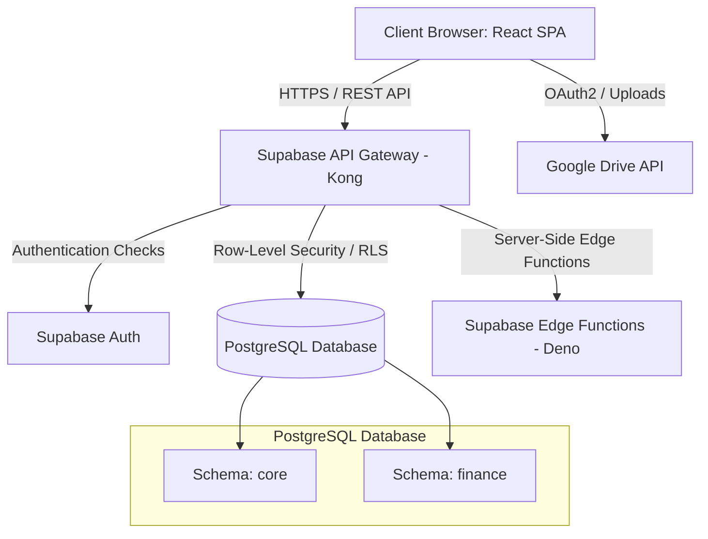
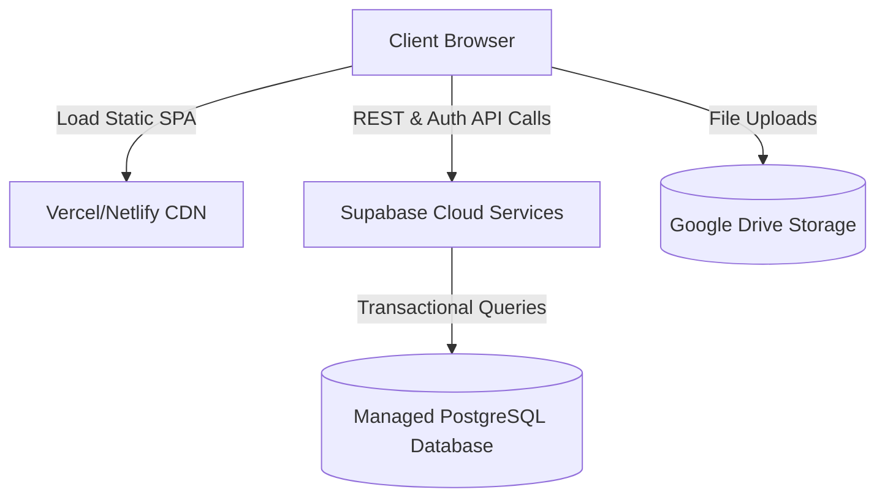

# 07 - System Architecture Specification

Version: 1.1  
Status: Draft  
Owner: SCOT (Sports and Cultural Organizers of Topaz)  

---

## 1. Architectural Style & Overview

The SCOT Community Operations Platform is designed using a **Serverless Backend-as-a-Service (BaaS)** architecture powered by **Supabase**. This minimizes deployment complexity, eliminates backend server hosting costs, and provides an integrated ecosystem for authentication, database storage, and serverless compute, while leveraging the **Google Drive API** for external document and media storage.

### 1.1 Structural Layout
The application flows directly from the client browser to Supabase and Google Drive API services:



1. **Presentation Layer:** A responsive React Single Page Application (SPA) running directly in the user's browser, communicating with Supabase and Google Drive via client SDKs.
2. **API Gateway Layer:** Kong (Supabase API Gateway) routes calls, handles CORS, and decodes JWT tokens.
3. **Logic and Access Control Layer:** PostgreSQL Row-Level Security (RLS) policies govern data access rules, while database functions (RPCs) and Deno Edge Functions handle custom server-side computations.
4. **Data and Storage Layer:** PostgreSQL (data persistence), Supabase Auth (identities), and Google Drive API (PDF receipts, vendor quotes, and media gallery photos/videos).

---

## 2. Technology Stack (Free Tier)

The system utilizes the following stack, fully supportable under free hosting tiers:

| Component | Technology | Hosting Provider | Cost |
| :--- | :--- | :--- | :--- |
| **Frontend Client** | React (Vite) / HTML5 / Vanilla CSS | Vercel or Netlify | **$0/month** (Free Tier) |
| **Database Engine** | PostgreSQL 16+ | Supabase Cloud | **$0/month** (Free Tier, up to 500MB) |
| **Authentication** | Supabase Auth (JWT) | Supabase Cloud | **$0/month** (Free Tier, up to 50k MAU) |
| **Object Storage** | Google Drive API (Admin account) | Google Drive | **$0/month** (Free Tier, 15GB total) |
| **Serverless Compute** | Supabase Edge Functions (Deno/TS) | Supabase Cloud | **$0/month** (Free Tier, generous limits) |

---

## 3. Data Isolation & Boundary Enforcement

Security and multi-season/wing boundaries are enforced directly in the database using **PostgreSQL Row-Level Security (RLS)** policies. This prevents unauthorized CRUD operations even if client code is modified.

### 3.1 Season-Level Isolation
All operational tables are tenant-scoped via a `season_id` column.

#### 3.1.1 Query Scoping
To query data only from the active season, client queries filter by `season_id`. To guarantee that no archived data is exposed or modified accidentally, RLS policies enforce access restrictions:

```sql
-- Enforce that reads are only allowed if the season is active (or user is an Admin)
CREATE POLICY active_season_read_policy ON core.event
    FOR SELECT
    USING (
        season_id IN (SELECT id FROM core.season WHERE status = 'ACTIVE')
        OR
        (auth.jwt() -> 'user_metadata' ->> 'role')::text IN ('SCOT_ADMIN', 'CORE_TEAM')
    );
```

#### 3.1.2 Read-Only Archive Restriction
To protect archived season data from modifications, database-level RLS policies block `INSERT`, `UPDATE`, and `DELETE` operations on any record associated with an archived season:

```sql
-- Prevent updates on archived data
CREATE POLICY active_season_write_policy ON core.event
    FOR UPDATE
    WITH CHECK (
        season_id IN (SELECT id FROM core.season WHERE status = 'ACTIVE')
    );
```

### 3.2 Wing-Level Isolation
Wing Commanders and Wing Captains assignments are mapped as custom claims in the user's Supabase Auth JWT:
* User metadata contains: `role: 'WING_CAPTAIN', wing_id: 'UUID-X'`.
* RLS policies verify these claims to restrict CRUD operations on wing-based teams or registrations:

```sql
-- Allow Wing Captains to create registrations only for their own wing
CREATE POLICY wing_captain_registration_policy ON core.registration
    FOR INSERT
    WITH CHECK (
        (auth.jwt() -> 'user_metadata' ->> 'role') = 'WING_CAPTAIN'
        AND
        resident_id IN (
            SELECT resident_id FROM core.resident_flat_assignment rfa
            JOIN core.flat f ON rfa.flat_id = f.id
            WHERE f.wing_id = (auth.jwt() -> 'user_metadata' ->> 'wing_id')::uuid
        )
    );
```

---

## 4. Plug-and-Play Finance Integration

To keep the Finance Module plug-and-play in a single database, the schema is physically separated, and communication goes through a database RPC layer.

### 4.1 Schema Partitioning
* **`core` Schema:** Contains tables for Organization, Residents, Events, Competitions, Tasks, and Media.
* **`finance` Schema:** Contains tables for Contributions, Sponsors, Vendors, and Expenses. No tables in `core` reference tables in `finance` via database-level foreign keys.

### 4.2 Decoupled Functions (RPC)
The `core` registration logic calls a PostgreSQL function inside the `finance` schema to check eligibility. This decouples database schema structures:

```sql
-- core registrations call this RPC to verify payment eligibility
CREATE OR REPLACE FUNCTION finance.is_flat_eligible(target_flat_id UUID, active_season_id UUID)
RETURNS BOOLEAN AS $$
BEGIN
    RETURN EXISTS (
        SELECT 1 FROM finance.flat_contribution
        WHERE flat_id = target_flat_id 
          AND season_id = active_season_id 
          AND status = 'PAID'
    );
END;
$$ LANGUAGE plpgsql SECURITY DEFINER;
```

If the internal database tables in the `finance` schema are replaced in the future by an external payment API (e.g. Stripe or QuickBooks), the function body of `finance.is_flat_eligible` is modified to call a Supabase Edge Function API request, requiring no modifications to the database structure in the `core` schema.

---

## 5. Security & Access Control

### 5.1 User Authentication
* Residents sign in using email/password or phone numbers via the Supabase Auth client SDK.
* Successful authentication issues a JWT stored client-side in an HTTP-Only secure cookie or managed inside the React client state.

### 5.2 Authorization (RBAC)
Instead of custom backend checks, RLS policies compare user metadata claims (`role`, `wing_id`) directly on each query transaction:
* **SCOT Admin:** Absolute access (`role = 'SCOT_ADMIN'`).
* **Core Team:** General operations access (`role = 'CORE_TEAM'`).
* **Event Champion:** Access restricted to assigned events in the event manager mapping (`role = 'EVENT_CHAMPION'`).
* **Residents:** Read-only access to schedules and leaderboards; self-registration limits.

---

## 6. Deployment & Hosting Blueprint

### 6.1 Local Development Environment (Offline First)
The **Supabase CLI** orchestrates a complete offline development environment. It runs lightweight Docker containers on the developer's computer simulating the cloud platform:
* Run command: `supabase start`
* Local services hosted:
  * PostgreSQL Database (port `54322`)
  * Supabase Studio Admin UI (port `54323`)
  * Auth / GoTrue service (port `9999`)
  * Local Edge Functions runner

### 6.2 Production Architecture
A simple, zero-maintenance serverless setup:


