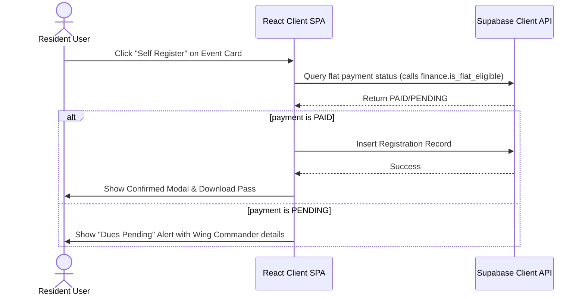
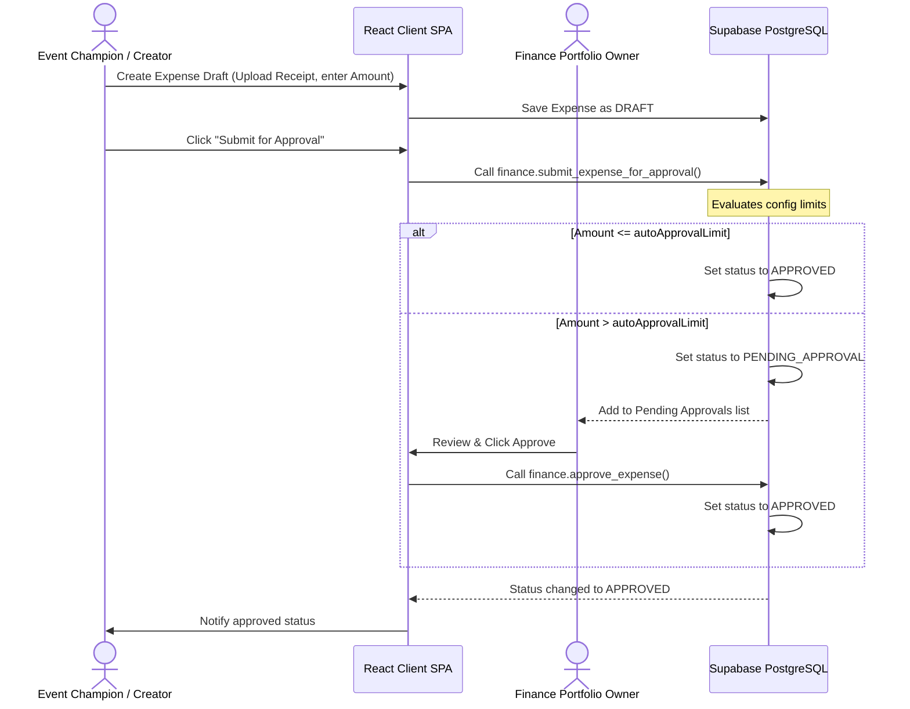

# 09 - UI Navigation Specification

Version: 1.0  
Status: Draft  
Owner: SCOT (Sports and Cultural Organizers of Topaz)  

---

## 1. Client-Side Routing Architecture

The SCOT Community Operations Platform is built as a single-page React application. Client-side routing is handled via **React Router**, dividing views into public, resident-only, and organizer-only routes.

### 1.1 Route Mapping Table

| Route | Access Level | Description |
| :--- | :--- | :--- |
| `/login` | Public | Authentication gate using email or phone number. |
| `/` or `/dashboard` | Resident & Member | Active season statistics, announcements ticker, and quick links. |
| `/events` | Resident & Member | Interactive calendar and lists of standalone, umbrella, and sub-events. |
| `/events/:id` | Resident & Member | Detailed event page (includes self-registration buttons). |
| `/leaderboard` | Resident & Member | Seasonal Wing Championship points standings and competition history. |
| `/announcements` | Resident & Member | Message board for global, wing, and event-specific updates. |
| `/gallery` | Resident & Member | Media library grouped by seasons and event albums. |
| `/admin` | SCOT Member | Organizer command dashboard showing task status and season configurations. |
| `/admin/members` | SCOT Admin | User provisioning, seasonal role assignments, and flat occupancy. |
| `/admin/contributions`| Core & Wing Commander | Flat contribution tracking ledger and paid status overrides. |
| `/admin/events` | Event Champion & Admin | Form to create events, sub-events, and assign Champions. |
| `/admin/competitions`| Event Champion & Admin | Fixtures builder, tournament bracket configurations, and score input. |
| `/admin/finance` | Core & Event Champion | Sponsorship pipeline tracker, vendor quotations repository, and expense logs. |
| `/admin/tasks` | SCOT Member | Kanban board tracking global, portfolio, and event tasks. |

---

## 2. Multi-Role Sitemap Views

The user interface adapts dynamically based on the authenticated user's custom JWT claims (`role`).

### 2.1 Resident Interface Sitemap
Residents are presented with a clean, consumption-focused layout:

```
[Resident UI Frame]
 ├── Top Bar (Active Season Selector, Profile Menu)
 └── Sidebar Navigation
      ├── Dashboard (My flat status, quick metrics)
      ├── Events (Browse and self-register)
      ├── Leaderboard (Interactive standings)
      ├── Announcements (View updates)
      └── Gallery (Browse photos)
```

### 2.2 SCOT Organizer Interface Sitemap
SCOT members see a unified sidebar that appends admin control panels:

```
[Organizer UI Frame]
 ├── Top Bar (Active Season Selector, Task Alerts, Profile Menu)
 └── Sidebar Navigation
      ├── [Resident Links] Dashboard, Events, Leaderboard, Announcements, Gallery
      ├── Divider (Admin Panels)
      ├── Members (Provision users/roles)
      ├── Contributions (Manage ₹3000 dues)
      ├── Competitions & Brackets (Fixtures & scores)
      ├── Finance Portal (Vendor bids & expense approvals)
      └── Kanban Tasks (Manage portfoilio work)
```

---

## 3. Layout Wireframes & Design Token Mappings

The layout is built with a responsive CSS grid structure. 

### 3.1 Overall Framework Structure
* **Sidebar:** Fixed width (`260px`) on desktop. Collapses into a hamburger menu drawer on mobile screens.
* **Header:** Top-aligned (`70px` height) containing the brand logo, active Season selector dropdown, user profile icon, and notification alerts.
* **Main Content Area:** Auto-scrollable layout with standard padding (`2rem`).

### 3.2 Main Responsive Breakpoints
* **Mobile:** `< 768px` (Fluid single-column layouts, hidden sidebar, bottom navigation tab bar).
* **Tablet:** `768px` to `1024px` (Two-column grids, icon-only sidebar).
* **Desktop:** `> 1024px` (Full three-column dashboard cards, fully expanded sidebar).

---

## 4. Core Navigational User Flows

Below are the interaction sequence blueprints for key workflows.

### 4.1 Resident Event Registration Gating Flow
Enforces the annual contribution eligibility requirement:



### 4.2 Event Champion Score Recording Flow
Enforces configurable tie-breaker rules and scores:

```mermaid
sequenceDiagram
    actor Champ as Event Champion
    participant App as React Client SPA
    participant Supabase as Supabase Database
    
    Champ->>App: Open Fixture Card -> Click "Record Score"
    App->>Champ: Render score inputs & tie-resolution policy options
    Champ->>App: Input scores -> Click Submit
    App->>App: Check for tied score
    alt Score is Tied
        Note over App: Look up tiedPlacementResolution config
        alt Resolution = SPLIT
            App->>App: Merge and split points equally
        alt Resolution = FULL
            App->>App: Award full placement points
        end
    end
    App->>Supabase: Update CompetitionParticipant status & points
    Supabase-->>App: Standings updated
    App->>Champ: Show Success Toast
```

### 4.3 Expense Draft to Disbursement Workflow
Enforces portfolio-owner and core-team approval limits:


