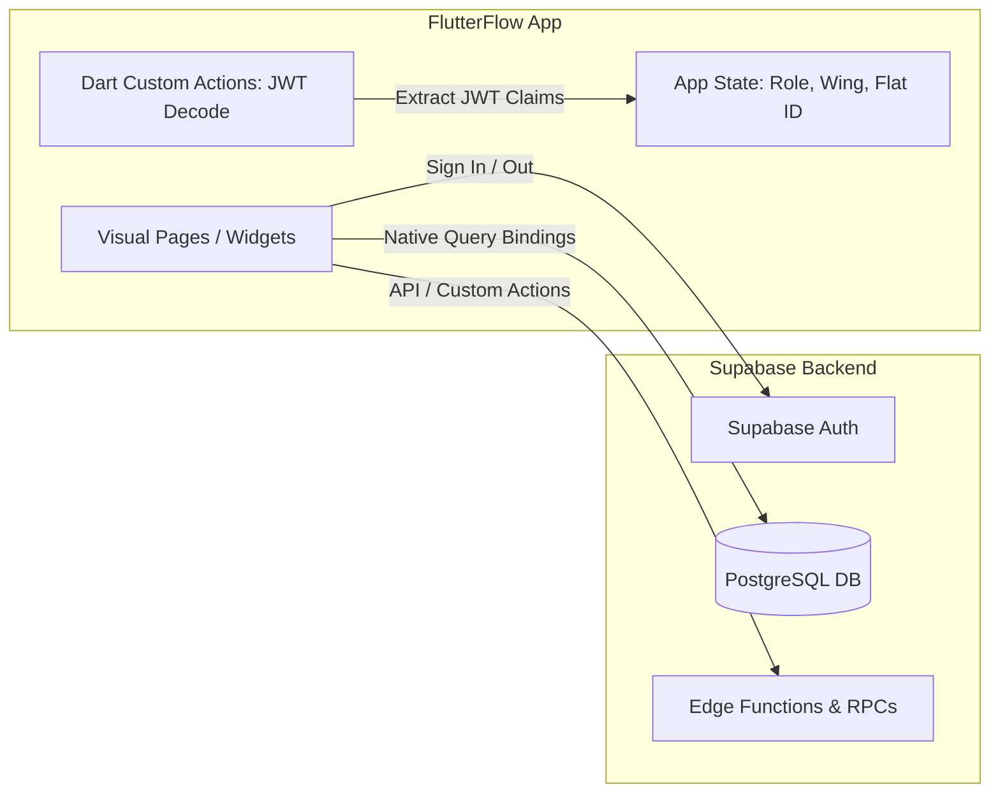
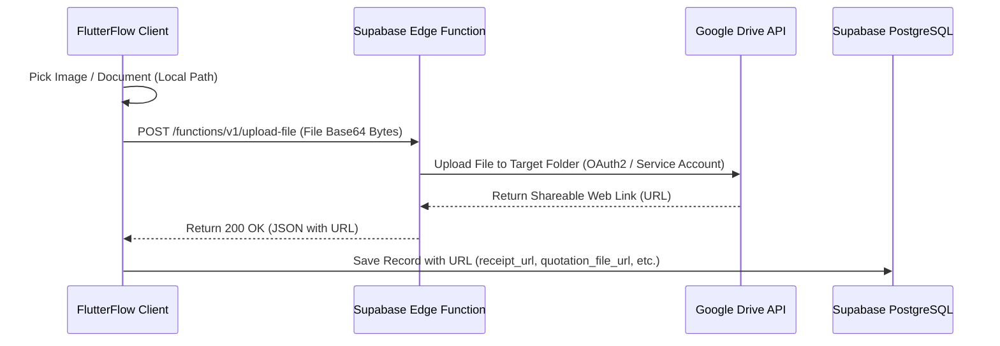

# 15 - FlutterFlow Build Plan Specification

Version: 1.0  
Status: Draft  
Owner: SCOT (Sports and Cultural Organizers of Topaz)  

---

## 1. Introduction & FlutterFlow Scope

This specification provides the physical implementation plan for constructing the SCOT frontend application using **FlutterFlow**. FlutterFlow will serve as our visual builder to compile the cross-platform application (Web, Android, and iOS) while relying on **Supabase** for database operations, authentication, and custom serverless logic, and **Google Drive API** for binary storage.

This build plan translates the [12 - Screen Inventory Specification](file:///c:/Personal/AI%20Projects/SCOT/specs/12-screen-inventory.md) into concrete FlutterFlow widgets, database bindings, local App State configurations, custom Dart actions, and API connections.



---

## 2. Supabase Integration Setup

To link FlutterFlow to the Supabase BaaS project, execute the following configuration steps in the FlutterFlow settings panel:

### 2.1 Configuration Variables
* **Enable Supabase:** Toggle the Supabase integration switch to `ON` under **Settings > Integrations > Supabase**.
* **API URL:** Paste the Supabase Project URL.
* **Anon Key:** Paste the Supabase public anonymous key.
* **Auto-Generate Database Schema:** Import the tables and views from the `core` and `finance` schemas so they are mapped as FlutterFlow Data Types.

### 2.2 Authentication Configuration
* **Authentication Type:** Select `Supabase` from the Auth type dropdown in **Settings > App Details > Authentication**.
* **Initial Page:** Set the initial page to `SCR-001 (Credentials Login)`.
* **Logged-In Page:** 
  - Set to `SCR-002 (Resident Dashboard)` for standard resident profiles.
  - Set to `SCR-008 (Coordinator Dashboard)` for member profiles.
  - *Dynamic routing is handled via a post-login routing action.*

---

## 3. Global App State & JWT Claim Extraction

Since Supabase Row-Level Security (RLS) is audited using custom JWT user metadata claims, the FlutterFlow client must decode these claims upon authentication and store them locally in **App State** variables. This prevents recursive query loads and drives conditional UI visibility.

### 3.1 App State Schema
Define the following non-persisted App State fields:

| Variable Name | Type | Description |
| :--- | :--- | :--- |
| `activeSeasonId` | String (UUID) | The ID of the current active season (fetched on app start). |
| `userRole` | String | User's operational role (e.g. `WING_COMMANDER`, `HOME_CHIEF`). |
| `userWingId` | String (UUID) | The wing assigned to the user (null for global roles). |
| `userFlatId` | String (UUID) | The flat assigned to the resident (null for organizers). |
| `userResidentId` | String (UUID) | The master resident profile ID (null for organizers). |
| `userMemberId` | String (UUID) | The master member profile ID (null for residents). |

### 3.2 Custom Action: `decodeJwtClaims`
This custom Dart action parses the JWT token returned by Supabase Auth and caches metadata in App State.

* **Trigger:** Post-Login Action chain, and On App Load Action chain (if user is already logged in).
* **Arguments:** None.

```dart
import 'dart:convert';
import 'package:supabase_flutter/supabase_flutter.dart';
import '/flutter_flow/flutter_flow_util.dart';

Future<void> decodeJwtClaims() async {
  final supabase = Supabase.instance.client;
  final session = supabase.auth.currentSession;
  
  if (session == null) return;
  
  final token = session.accessToken;
  final parts = token.split('.');
  if (parts.length != 3) return;
  
  // Decode JWT payload
  final payloadDecoded = utf8.decode(base64Url.decode(base64Url.normalize(parts[1])));
  final Map<String, dynamic> payload = json.decode(payloadDecoded);
  
  final metadata = payload['user_metadata'] as Map<String, dynamic>?;
  if (metadata == null) return;

  // Assign to FlutterFlow App State variables
  FFAppState().userRole = metadata['role'] ?? 'HOME_MEMBER';
  FFAppState().userWingId = metadata['wing_id'] ?? '';
  FFAppState().userFlatId = metadata['flat_id'] ?? '';
  FFAppState().userResidentId = metadata['resident_id'] ?? '';
  FFAppState().userMemberId = metadata['member_id'] ?? '';
  
  // Query active season ID from core.season where status = 'ACTIVE'
  final seasonResponse = await supabase
      .from('season')
      .select('id')
      .eq('status', 'ACTIVE')
      .maybeSingle();
      
  if (seasonResponse != null) {
    FFAppState().activeSeasonId = seasonResponse['id'];
  }
}
```

---

## 4. Screen-by-Screen Widget & Binding Plan

This section outlines the setup for all 14 screens defined in the inventory.

### SCR-001: Credentials Login
* **Layout:** Centered column, container card, modern text fields for email and password, logo.
* **Authentication Action:**
  - On Button Press $\to$ Add Action `Supabase Auth - Log In` (Email, Password).
  - Add Action `Custom Action: decodeJwtClaims`.
  - Conditional Action:
    - If `FFAppState().userRole` is `SCOT_ADMIN`, `CORE_TEAM`, or `EVENT_CHAMPION` $\to$ Navigate to `SCR-008 (Coordinator Dashboard)`.
    - Else $\to$ Navigate to `SCR-002 (Resident Dashboard)`.

### SCR-002: Resident Dashboard
* **Layout:** Responsive layout with sidebar (web) or bottom navigation bar (mobile).
* **Bindings:**
  - **Dues Status Banner:** Row component. Query `finance.flat_contribution` where `flat_id = FFAppState().userFlatId` and `season_id = FFAppState().activeSeasonId`. 
    - If status is `PAID` $\to$ Show green badge "Dues Paid".
    - Else $\to$ Show red badge "Dues Pending - Events Registration Locked".
  - **Quick Announcements Carousel:** Query `core.announcements` (filtered by active season) limited to 5 records.
  - **My Events Registration List:** ListView query on `core.registration` matching `resident_id = FFAppState().userResidentId`.

### SCR-003: Events Calendar Grid
* **Layout:** GridView or Calendar widget layout.
* **Bindings:**
  - Query `core.event` filtered by `season_id = FFAppState().activeSeasonId`.
  - List item links to `SCR-004 (Event Details)` passing the `eventId` parameter.

### SCR-004: Event Details & Registration
* **Layout:** Image banner (Google Drive asset), details column, registration card.
* **Parameters:** `eventId` (UUID).
* **Page Load Query:** Query `core.event` by `eventId`.
* **Registration Action Buttons (Conditional Logic):**
  - Query registration state: Retrieve `core.registration` where `event_id = eventId` and `resident_id = FFAppState().userResidentId`.
  - **Scenario A (Already Registered):** If registration record exists $\to$ Disable button, display text "Already Registered".
  - **Scenario B (Pending Dues):** If contribution status of flat is `PENDING` $\to$ Disable button, show text "Dues Pending - Dues payment required to register".
  - **Scenario C (Eligible to Register):** If status is `PAID` and no registration exists $\to$ Enable "Register Me" button.
    - On Click $\to$ Execute **API Call: `registerResident`** passing `resident_id`, `event_id`, `season_id`, and `registration_method = 'SELF'`.
    - Show success toast message.

### SCR-005: Wing Championship Leaderboard
* **Layout:** ListView with custom standings row (ranking index, wing letter badge, points count).
* **Bindings:**
  - Query `core.wing_score` filtered by `season_id = FFAppState().activeSeasonId` aggregated and sorted in descending order of points.
  - Display tied positions using split calculations in the UI layer if points match.

### SCR-006: Event Gallery Albums
* **Layout:** GridView of album cards (title, event reference, upload date).
* **Bindings:**
  - Query `core.gallery_album` where `season_id = FFAppState().activeSeasonId`.

### SCR-007: Media Carousel Viewer
* **Layout:** Fenced full-screen Carousel view with swipe controls.
* **Parameters:** `albumId` (UUID).
* **Bindings:**
  - Query `core.media_item` where `album_id = albumId`.
  - Image paths bind directly to `url` field (displaying Google Drive web-sharing link).

### SCR-008: Coordinator Dashboard
* **Layout:** Sidebar menu layout with metrics cards.
* **Bindings:**
  - **Metrics Cards:** Row of widgets compiling total collected contributions, pending dues count, active competition count, and open tasks.
  - Query database aggregations directly from custom views inside Supabase.

### SCR-009: Role & Committee Roster Provisioning
* **Layout:** Table widget or list builder with search bar and filter chips.
* **Bindings:**
  - Query `core.member_season_assignment` where `season_id = FFAppState().activeSeasonId`.
  - Action button "Assign Role" launches a modal form to insert a role mapping.

### SCR-010: Wing Flat Dues Overrides
* **Layout:** Wing-filtered ListView showing Flat Number and Dues status toggle.
* **Bindings:**
  - Filter list by selected Wing (Dropdown bound to `core.wing` selection).
  - Fetch contribution statuses from `finance.flat_contribution`.
  - **Override Dues Action Button:**
    - Launches a modal: Upload receipt (integrated with Google Drive) and input amount.
    - Click "Confirm" $\to$ Triggers Custom Action `callRecordPayment` (executing Supabase RPC).

### SCR-011: Competition Bracket Builder
* **Layout:** Configuration form (text inputs, dropdowns) linked to bracket visualizations.
* **Bindings:**
  - Inputs bind to `scoringRuleJson` schema.
  - Action button "Generate Fixtures" triggers tournament generation algorithms.

### SCR-012: Sponsorship Collections Tracker
* **Layout:** Metrics card showing committed vs. collected, list of active corporate sponsors.
* **Bindings:**
  - Query `finance.sponsor` where `season_id = FFAppState().activeSeasonId`.
  - Input forms to add sponsor commitments or log collections.

### SCR-013: Vendor Quotations Uploader
* **Layout:** Quotation submission form (select vendor, select event, enter amount, attach quotation file).
* **Bindings:**
  - Vendor dropdown lists `finance.vendor`.
  - Upload file component triggers Google Drive upload workflow, writing the resulting URL to `finance.vendor_quotation`.

### SCR-014: Expense Approval Manager
* **Layout:** List of expenses grouped by Status tabs (Draft, Pending Approval, Approved).
* **Bindings:**
  - Query `finance.expense` where `season_id = FFAppState().activeSeasonId`.
  - Form to submit new expense drafts.
  - "Submit for Approval" button calls `finance.submit_expense_for_approval` RPC.

---

## 5. API & Custom Stored Procedure (RPC) Integrations

For custom transaction logic and serverless calls, configure REST API calls in FlutterFlow under **API Calls**:

### 5.1 API Call: `registerResident`
* **Method:** `POST`
* **URL:** `[Supabase_Project_URL]/functions/v1/register-resident`
* **Headers:** 
  - `Authorization: Bearer [User_JWT]`
  - `Content-Type: application/json`
* **JSON Body:**
```json
{
  "resident_id": "[residentId]",
  "event_id": "[eventId]",
  "sub_event_id": "[subEventId]",
  "registration_method": "[method]",
  "season_id": "[seasonId]"
}
```

### 5.2 API Call: `recordScore`
* **Method:** `POST`
* **URL:** `[Supabase_Project_URL]/functions/v1/record-score`
* **Headers:** 
  - `Authorization: Bearer [User_JWT]`
  - `Content-Type: application/json`
* **JSON Body:**
```json
{
  "fixture_id": "[fixtureId]",
  "scores": "[scoresArray]",
  "is_walkover": "[isWalkover]",
  "walkover_absent_participant_id": "[absentParticipantId]"
}
```

### 5.3 Stored Procedure RPC Action: `recordPayment`
Trigger database procedure payments from the client:
* **Dart Action Code:**
```dart
import 'package:supabase_flutter/supabase_flutter.dart';

Future<void> callRecordPayment(
  String flatId,
  String seasonId,
  double amount,
  String memberId,
) async {
  final supabase = Supabase.instance.client;
  await supabase.rpc('record_payment', params: {
    'target_flat_id': flatId,
    'active_season_id': seasonId,
    'payment_amount': amount,
    'recorder_member_id': memberId,
  });
}
```

### 5.4 Stored Procedure RPC Action: `submitExpenseForApproval`
Trigger expense routing:
* **Dart Action Code:**
```dart
import 'package:supabase_flutter/supabase_flutter.dart';

Future<void> callSubmitExpense(String expenseId) async {
  final supabase = Supabase.instance.client;
  await supabase.rpc('submit_expense_for_approval', params: {
    'target_expense_id': expenseId,
  });
}
```

---

## 6. Google Drive File Upload Workflow

Since Supabase Storage is capped at 1GB, files are uploaded directly to the Coordinator's Google Drive via a proxy Deno Edge Function using a Service Account config.

### 6.1 Upload Sequence



### 6.2 FlutterFlow Action Configurations
1. **Trigger Component:** File Upload Widget (e.g. upload receipt button).
2. **First Action (Upload Media):** Pick media/file (store local path).
3. **Second Action (API Call):** Call `uploadFileToDrive` API Endpoint:
   - Body: Send base64-encoded bytes extracted from file.
4. **Third Action (Database Write):** Save the returned shareable URL string into the respective table record field (`receipt_url` in `finance.flat_contribution` or `quotation_file_url` in `finance.vendor_quotation`).
